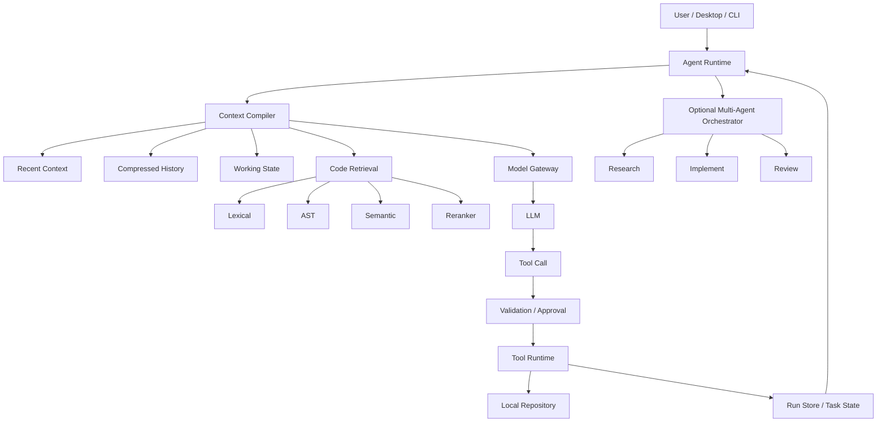

# CodeCub

> A local-first Coding Agent harness for repository understanding, context management, tool execution, and safe code changes.

**CodeCub** 是一个本地优先的 AI Coding Agent 桌面应用，面向真实代码仓库运行。

它不只是把代码发送给大模型进行聊天，而是提供了一套完整的 Agent Harness：

**代码检索 → 上下文编译 → 模型推理 → 工具调用 → 文件修改 → 状态记录 → 安全控制**

CodeCub 可以在用户本地项目中读取代码、定位符号和调用关系、执行工具、修改文件，并通过上下文治理、权限审批、故障恢复和副作用保护等机制，让长任务执行更加可控。

项目同时提供：

- **Single Agent**：默认执行模式，适合普通代码分析和修改任务
- **Multi-Agent**：复杂任务下可显式开启，将任务拆分为 Research / Implement / Review
- **Desktop App**：Electron + React 桌面客户端
- **CLI**：可直接在终端运行 Agent

---

## ✨ Features

### 1. Agent Runtime

CodeCub 实现了完整的 Agent Loop，而不是单轮 LLM 调用。

Runtime 负责：

- 接收用户任务
- 构建当前项目上下文
- 调用模型
- 解析 Tool Call
- 执行工具
- 将执行结果反馈给模型
- 保存运行状态
- 控制任务循环
- 处理异常与恢复

基本流程：

```text
User Task
   ↓
Context Compilation
   ↓
Model
   ↓
Tool Call
   ↓
Tool Runtime
   ↓
Observation
   ↓
Model
   ↓
...
   ↓
Final Result
```

---

## 🔍 Hybrid Code Retrieval

大型代码仓库中，Agent 首先要解决的问题不是“怎么生成代码”，而是：

> **应该读哪个文件、哪个类、哪个函数？**

CodeCub 实现了多路混合代码检索：

```text
Lexical Search
      +
AST Symbol Search
      +
Semantic Retrieval
      +
Reranker
      ↓
Candidate Fusion
      ↓
Relevant Code
```

主要能力包括：

- **Lexical Retrieval**
  - 基于关键词进行快速代码定位
- **AST Retrieval**
  - 基于 Python AST 建立结构化符号索引
  - 支持函数、类、异步函数等符号定位
- **Semantic Retrieval**
  - 处理关键词难以覆盖的语义型代码定位任务
- **Reranker**
  - 对候选代码进一步排序
- **Fast Path**
  - 对明确的 definition / reference 等结构化查询优先走结构化路径，避免不必要的语义检索成本

### Evaluation

在 **20 个隔离 Holdout 代码定位任务**中：

| Retrieval Strategy | Top-3 |
|---|---:|
| Pure Lexical | 30% |
| Hybrid Retrieval | **85%** |

Hybrid Retrieval 的 Top-3 命中率从 **30% 提升至 85%**。

> 该结果来自固定代码定位任务，不代表所有代码仓库上的泛化准确率。

---

## 🧠 Context Engineering

Coding Agent 的上下文会随着任务执行不断增长：

- 用户需求
- 模型回复
- `read_file`
- 搜索结果
- 测试日志
- 修改记录
- 历史判断
- Tool Result

如果全部原样发送给模型，会出现：

- Prompt 快速膨胀
- 重复代码被反复注入
- 旧信息干扰当前判断
- 超出模型上下文预算
- Token 成本增加

CodeCub 因此实现了分层 **Context Compiler**。

### Context Layers

```text
┌──────────────────────────────┐
│ System / Current User Task   │
├──────────────────────────────┤
│ Recent Verbatim History      │
├──────────────────────────────┤
│ Working State                │
├──────────────────────────────┤
│ Compressed History           │
├──────────────────────────────┤
│ Retrieved Code / Evidence    │
├──────────────────────────────┤
│ Repo / Memory Context        │
└──────────────────────────────┘
              ↓
        Token Budget
              ↓
      Provider-bound Prompt
```

### State-Preserving Compression

对于较旧的历史，CodeCub 不只是简单截断，而是进行 State-Preserving Compression。

压缩时优先保留：

- 用户明确约束
- 禁止修改项
- 已确认事实
- 兼容性要求
- 已做出的决策
- 文件 / 符号证据
- 当前任务的重要状态

最终 production 默认：

```text
State-Preserving Compression = ON
Adaptive Hybrid Raw Evidence = OFF
```

Hybrid Raw Evidence 目前保留为 experimental / opt-in 能力，不作为默认策略。

---

## 📖 Freshness & Read Coverage

Coding Agent 在长任务中很容易重复读取同一份源码。

例如：

```text
read_file(runtime.py, 1-200)
↓
进行若干分析
↓
再次 read_file(runtime.py, 1-200)
```

如果文件没有发生变化，第二次完整读取通常只是重复占用 Context。

CodeCub 使用：

- **File Freshness**
- **Read Range Coverage**
- **Read Evidence Ledger**

记录已经读取过的源码范围。

### Behavior

如果请求范围已经完整读取：

```text
Request:
1-200

Already Covered:
1-200

→ suppress repeated source injection
```

如果只是部分重叠：

```text
Already Covered:
1-100

Request:
1-150

→ only return 101-150
```

如果文件之后被修改：

```text
read file
↓
patch file
↓
freshness changed
↓
old coverage invalidated
↓
allow new read
```

### Evaluation

在 **10 个固定 Agent 任务**中：

```text
Invalid repeated source reads:
9 → 0
```

同时没有观察到“源码已经修改，但读取被旧 Coverage 错误抑制”的情况。

---

## 🤖 Single Agent & Multi-Agent

CodeCub 默认采用 **Single Agent**。

```bash
uv run codecub "Fix the bug in the runtime"
```

复杂任务可以显式开启 Multi-Agent：

```bash
uv run codecub "Analyze and refactor the runtime" --multi-agent
```

---

## Why Multi-Agent?

Multi-Agent 并不是为了让所有任务都调用更多模型。

简单任务继续使用 Single Agent，避免额外的：

- 模型调用
- Token 成本
- 调度成本
- 角色通信成本

对于可以自然拆分的复杂任务，CodeCub 提供：

```text
           User Task
               ↓
          Orchestrator
          /     |      \
         /      |       \
 Research   Implement   Review
```

### Research

主要负责：

- 阅读代码
- 搜索仓库
- 定位调用链
- 收集证据
- 分析问题

通常以只读权限运行。

### Implement

负责：

- 文件修改
- Patch
- 实际实现

写操作集中到 Implement，避免多个角色同时修改同一份代码。

### Review

负责：

- 检查修改结果
- 发现潜在问题
- 验证实现与任务要求是否一致

---

## Parallel Scheduling

对于没有写冲突的 Research / Review 工作，CodeCub 支持并行调度。

Implement 仍保持受控执行，而不是盲目并行多个写 Agent。

### Evaluation

在 **15 组未参与调参的 Serial / Parallel 任务对比**中：

| Metric | Serial | Parallel |
|---|---:|---:|
| Mean Wall-clock | 116.33s | **85.57s** |
| Mean Total Tokens | 36,977 | 37,518 |
| Merge Failures | 0 | 0 |

结果：

- 平均 Wall-clock **下降 26.4%**
- Token 开销仅增加约 **1.5%**
- 未观察到 Merge Failure

Multi-Agent 的实验主要证明：

> **对于可拆分任务，并行调度能够降低整体等待时间。**

该实验**不证明 Multi-Agent 一定提升任务正确率**。

---

## 🛠 Tool Runtime

CodeCub 的 Tool Calling 不直接把模型生成内容当作可信操作执行。

所有工具调用都进入统一 Runtime 路径。

```text
Model Tool Call
      ↓
Schema Validation
      ↓
Permission / Path Validation
      ↓
Approval
      ↓
Safety / Replay Check
      ↓
Tool Execution
      ↓
Result Validation
      ↓
Trace / State Update
```

工具能力包括代码读取、搜索、修改、Shell 等，具体可用工具以当前 Tool Registry 为准。

---

## 🔐 Approval & Tool Safety

不同工具具有不同风险等级。

对于可能产生副作用的操作，Runtime 可以执行：

- 参数校验
- 路径校验
- 权限检查
- Approval
- Side-effect protection
- Result validation

这使得 Tool Call 不只是：

```text
Model says "run it"
→ execute
```

而是：

```text
Model intent
→ validate
→ authorize
→ execute
```

---

## 🔁 Retry & Provider Fallback

Model Gateway 对不同错误进行分类。

### Transient Errors

例如：

- Timeout
- Connection Reset
- HTTP 408
- HTTP 429
- HTTP 5xx

可以进入 Retry / Fallback。

### Permanent Errors

例如：

- HTTP 400
- HTTP 401
- HTTP 403
- 其他普通 4xx

不会因为被错误分类而盲目重试。

---

## ⚡ Circuit Breaker

CodeCub 对工具失败提供 Circuit Breaker。

基本状态：

```text
CLOSED
   ↓ failures reach threshold
OPEN
   ↓ cooldown
HALF_OPEN
   ↓ success
CLOSED
```

用于避免故障工具持续被重复调用，从而阻止 Agent 陷入无意义失败循环。

---

## ✅ Tool Result Contracts

“工具函数成功返回”并不一定意味着“业务动作成功”。

例如：

```json
{
  "success": false
}
```

从 Python 函数角度看，这可能是一次正常返回。

但从业务语义看，它可能代表失败。

CodeCub 将：

```text
Technical Execution Success
```

和：

```text
Business Success
```

进行区分。

Tool 可以显式声明 Result Contract，例如：

- `process_exit_code`
- `boolean_field`
- `required_fields`
- `structured_result`

没有声明 Contract 的旧工具保持兼容行为，Runtime 不会擅自猜测任意字段的业务含义。

---

## 🛡 Side-Effect Replay Protection

对于具有真实副作用的工具，普通 Retry 是危险的。

例如：

```text
Tool commits operation
↓
response lost
↓
Agent thinks it failed
↓
retry
↓
duplicate side effect
```

因此 CodeCub 为副作用工具实现了基于稳定 `operation_key` 的持久化 Replay Protection。

### State Machine

```text
                ┌─────────┐
                │ CLAIMED │
                └────┬────┘
                     │ execute
              ┌──────┴──────┐
              ↓             ↓
        COMPLETED       UNCERTAIN
```

### COMPLETED

表示操作已经明确完成。

相同 `operation_key` 再次出现：

```text
→ block replay
```

### UNCERTAIN

表示外部操作可能已经发生，但 Runtime 无法确认最终结果。

此时 CodeCub 选择：

```text
block blind retry
```

而不是假设第一次一定失败。

### Operation Identity

当前 Replay Protection 基于：

- 显式稳定 `operation_key`
- 或稳定 native `tool_call_id`

同一个 key 还绑定：

```text
tool_name + args digest
```

如果相同 key 对应不同参数：

```text
→ idempotency_key_conflict
```

---

## Reliability Evaluation

在 **10 个全新的 untouched Side-Effect Replay 场景**中：

```text
Scenario Correctness: 10/10
Protected Duplicate Commits: 0
Approval Bypass: 0
Blind Retry After Uncertain: 0
Concurrent Duplicate Commit: 0
Resume Duplicate Commit: 0
```

覆盖：

- Completed operation replay
- Uncertain outcome
- Same-process concurrency
- Checkpoint / Resume
- Stable native Tool Call replay
- Approval denied
- Operation-key conflict
- Read-only compatibility

---

## ⚠️ Replay Protection Scope

CodeCub **不宣称 global exactly-once**。

当前保证的准确范围是：

> 在同一 run / durable resume scope 内，对具有稳定 `operation_key` 或稳定 native `tool_call_id` 的 Side-Effect Operation 提供 Replay Protection。

以下情况不在当前保证范围内：

- 两个新的 operation key 的语义等价操作
- Global exactly-once
- Cross-process exactly-once
- 不具有稳定 operation identity 的 Legacy Recovered Tool Text

当前 RunStore 的 claim locking 主要保证 same-process concurrency。

---

## 💾 Checkpoint & Resume

CodeCub 会将任务状态持久化到本地 Run State。

状态可包含：

- 当前任务状态
- 运行信息
- Context state
- Side-effect operation ledger
- Checkpoint metadata

因此恢复 Runtime 后，已经记录的副作用操作不会因为单纯重启 Runtime 而丢失 Replay Protection。

---

## 🧰 Native Tool Protocol Robustness

部分 OpenAI-compatible Provider 即使在 native tool mode 下，也可能输出文本形式的 Legacy Tool Call。

CodeCub 优先使用 Provider 原生：

```text
tool_calls
```

同时提供严格限制的兼容恢复路径。

只有满足严格格式的单一 Tool Envelope 才可能被恢复：

```xml
<tool>{"name":"...", "args":{...}}</tool>
```

恢复后仍然经过原有：

- Tool Registry
- Schema Validation
- Approval
- Permission
- Runtime

不会因为是兼容恢复路径而直接执行文本。

Malformed / ambiguous tool text 会被安全拒绝。

---

## 🖥 Desktop Application

CodeCub 提供 Electron + React + TypeScript 桌面端。

Desktop 负责：

- 打开本地项目
- 配置模型连接
- 创建 Agent Task
- 查看会话
- 查看运行输出
- 选择 Execution Mode
- 启动本地 Python Backend

### Execution Mode

Desktop 中可以选择：

```text
Single Agent
Multi-Agent
```

默认：

```text
Single Agent
```

只有选择 Multi-Agent 时，Desktop 才会以 Multi-Agent Mode 启动任务。

---

## 🏗 Architecture



---

## 📊 Evaluation Summary

| Area | Benchmark | Result |
|---|---|---|
| Hybrid Retrieval | 20 isolated Holdout code-location tasks | Top-3 **30% → 85%** |
| Context Read Governance | 10 fixed Agent tasks | Invalid repeated source reads **9 → 0** |
| Multi-Agent Scheduling | 15 Serial / Parallel comparisons | Mean wall-clock **↓26.4%** |
| Multi-Agent Cost | Same 15 comparisons | Token overhead **+1.5%** |
| Side-Effect Reliability | 10 untouched replay scenarios | **10/10**, duplicate commits **0** |

这些 benchmark 用于验证项目中的具体机制，不应解释为所有代码仓库或所有模型上的通用性能保证。

---

## 🚀 Quick Start

### Requirements

推荐环境：

- Python
- `uv`
- Node.js / npm（Desktop）
- Git

具体 Python / Node 版本请以项目配置文件为准。

---

### 1. Clone

```bash
git clone <your-codecub-repository>
cd CodeCub
```

---

### 2. Configure Model Provider

复制：

```bash
.env.example
```

为：

```bash
.env
```

然后按照 `.env.example` 填写模型 Provider 配置。

不要将 `.env` 提交到 Git。

CodeCub 支持 OpenAI-compatible Provider，具体 Provider / Model 取决于本地配置。

---

### 3. Install Python Dependencies

```bash
uv sync
```

---

### 4. Run Single Agent

Single Agent 是默认模式：

```bash
uv run codecub "Analyze this repository and locate the relevant implementation"
```

---

### 5. Run Multi-Agent

复杂任务可以显式开启：

```bash
uv run codecub "Analyze and modify this module" --multi-agent
```

---

## 🖥 Desktop Development

进入 Desktop：

```bash
cd desktop
```

安装依赖：

```bash
npm install
```

当前项目提供 Desktop 的：

```bash
npm run typecheck
npm run test
npm run build
```

用于类型检查、测试和构建。

具体开发启动命令请以 `desktop/package.json` 中当前 scripts 为准。

---

## ⚙️ Configuration

CodeCub 当前重要默认策略：

```text
Execution Mode:
Single Agent

Context Compiler:
ON

State-Preserving Compression:
ON

Adaptive Hybrid Raw Evidence:
OFF

Hard Truncation:
Fallback

Side-Effect Replay Protection:
ON
```

Hybrid Context 目前保留为 experimental / opt-in 功能。

---

## 🧪 Tests

Python：

```bash
uv run pytest -q
```

静态检查：

```bash
uv run ruff check .
```

Desktop：

```bash
cd desktop
npm run typecheck
npm run test
npm run build
```

在最终公开版本整理阶段，完整 Python 测试结果为：

```text
556 passed
2 skipped
4 deselected
```

Desktop 的 typecheck / tests / build 也已通过。

> 测试数量只是工程回归信息，不代表 Agent Benchmark 的任务正确率。

---

## 📁 Project Structure

```text
CodeCub/
├── codecub/                 # Python Agent backend
│   ├── runtime.py           # Agent loop / tool execution
│   ├── context_compiler.py  # Context compilation & compression
│   ├── model_gateway.py     # Provider retry / fallback
│   ├── orchestration.py     # Multi-Agent orchestration
│   ├── tools.py             # Tool registry / validation
│   ├── task_state.py        # Durable task state
│   └── run_store.py         # Run persistence
│
├── desktop/                 # Electron + React + TypeScript client
│   ├── electron/
│   └── src/
│
├── tests/                   # Python test suite
├── benchmarks/              # Evaluation definitions / runners
├── scripts/                 # Utility / validation scripts
├── assets/                  # Project assets
│
├── .env.example
├── .gitignore
├── pyproject.toml
├── uv.lock
└── README.md
```

具体目录可能随项目继续演进，以当前仓库为准。

---

## 🔒 Local-First Design

CodeCub 将代码仓库、运行状态、索引和 Agent 执行环境尽量保留在用户本机。

项目同时对以下本地数据进行 Git 隔离：

```text
.env
.codecub/index/
.codecub/cache/
.codecub/runs/
.codecub/sessions/
.codecub/usage/
.workbuddy/
desktop/node_modules/
desktop/dist-renderer/
```

这些运行时数据和生成内容不应提交到公开仓库。

需要注意：

> “Local-first” 不代表模型推理一定发生在本机。

如果配置的是云端 LLM Provider，发送给模型的 Prompt 仍会通过对应 Provider API。

请根据实际 Provider 的隐私政策和数据处理规则使用。

---

## 🔐 Secret Safety

CodeCub 包含本地 Secret / Credential 相关保护逻辑，并将 `.env` 从 Git 中排除。

公开仓库只提供：

```text
.env.example
```

不要提交：

- API Key
- Token
- Password
- Authorization Header
- Runtime Log 中的敏感信息

---

## ⚠️ Limitations

CodeCub 目前仍存在明确边界。

### Multi-Agent does not guarantee better correctness

Multi-Agent 的主要收益来自：

- 角色隔离
- 权限隔离
- 可并行执行

当前实验主要验证了执行时间收益，并不证明 Multi-Agent 一定比 Single Agent 更准确。

---

### Side-effect protection is not exactly-once

当前 Replay Protection 不等于分布式系统意义上的 global exactly-once。

稳定 operation identity 是当前保护成立的重要前提。

---

### Cross-process side-effect protection is limited

当前 operation claim 的并发保护主要面向同一进程。

多进程同时执行相同 logical operation 时，不应认为当前版本具有严格的 cross-process exactly-once 保证。

---

### Legacy recovered tool calls have weaker identity guarantees

Legacy XML Tool Recovery 是兼容路径。

当 Provider 没有提供稳定 native `tool_call_id` 时，无法自动获得和原生 Tool Call 完全相同的 Replay Identity 保证。

---

### Context retention does not equal model correctness

即使 Context 中保留了正确事实，也不能保证模型一定会正确使用这些事实。

因此 CodeCub 更关注：

- Context 预算
- Evidence 管理
- Tool Safety
- Verification
- Failure containment

而不是假设 LLM 永远不会犯错。

---

## 🎯 Design Philosophy

CodeCub 的目标不是让 LLM “永远做对”。

更现实的目标是：

> **让一个本身具有不确定性的模型，在可观测、可验证、可恢复、受权限约束的 Agent Runtime 中工作。**

因此项目重点关注四个问题：

```text
Can the Agent find the right code?
          ↓
Hybrid Retrieval

Can it keep useful context under control?
          ↓
Context Engineering

Can complex work be isolated and parallelized?
          ↓
Multi-Agent Scheduling

Can failures and side effects remain controlled?
          ↓
Reliability & Tool Safety
```

---

## Roadmap

未来可以继续探索：

- 更大规模的跨仓库 Retrieval Evaluation
- Adaptive Single / Multi-Agent Routing
- Cross-process Side-Effect Claim
- Native downstream idempotency integration
- 更完善的 task verifier / automated review
- 更细粒度的 Context evidence selection
- 更多语言的结构化代码索引

这些能力不代表当前版本已经实现。

---

## License

请根据仓库实际 License 填写。

如果尚未选择 License，请在公开发布前确认使用的开源协议。

---

## Acknowledgements

CodeCub 在开发过程中参考了 Coding Agent、Context Engineering、代码检索与 Agent Runtime 等相关工程思路。

如果项目中直接使用或修改了第三方开源代码，请在此处按照对应 License 要求保留 attribution。

---

## Summary

CodeCub 希望解决的不是单纯的：

> “如何调用一个更强的模型？”

而是：

> **如何围绕模型构建一个能够理解真实代码仓库、控制上下文、执行工具、处理失败并限制副作用的 Coding Agent Harness。**

核心能力可以概括为：

**Retrieve accurately.  
Manage context deliberately.  
Execute tools safely.  
Parallelize when useful.  
Fail under control.**
